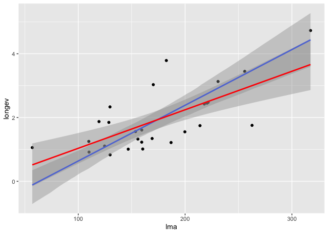

# Smooth lines for Standardised Major Axis (SMA) Regression


``` r
devtools::install_github("mattocci27/ggsma")
```

## Function

-   `geom_sma()`: draws fitted lines based on SMA.

## SMA (blue) vs OLS (red)

``` r
library(ggplot2)
library(ggsma)
library(smatr)

data(leaflife)
leaf_low <- subset(leaflife, soilp == "low")

ggplot(leaflife, aes(lma, longev)) +
  geom_point() +
  geom_sma() +
  geom_smooth(method = "lm", col = "red") 
```

    ## `stat_sma()` using method = 'sma' and formula 'y ~ x'

    ## `geom_smooth()` using formula 'y ~ x'

<!-- -->

## Reference

Warton, David I., Ian J. Wright, Daniel S. Falster, and Mark Westoby.
2006. Bivariate Line-Fitting Methods for Allometry. Biological Reviews
81: 259–91. <https://doi.org/10.1017/S1464793106007007>
