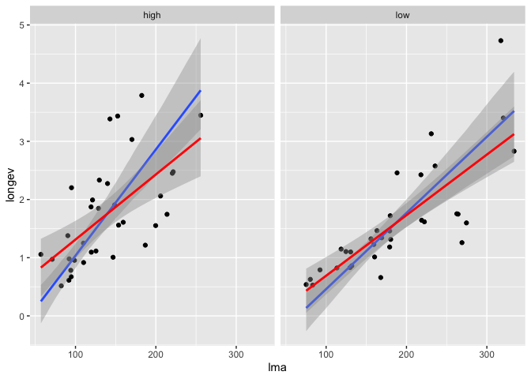

# Smooth lines for Standardised Major Axis (SMA) Regression


``` r
devtools::install_github("mattocci27/ggsma")
```

## Function

-   `geom_sma()`: draws fitted lines based on SMA.

## SMA (blue) vs OLS (red)

``` r
library(ggplot2)
library(ggsma)
library(smatr)

data(leaflife)
head(leaflife)
```

    ##   site rain soilp    longev       lma
    ## 1    1 high  high 1.1145511 125.48736
    ## 2    1 high  high 0.5161786  82.28108
    ## 3    1 high  high 0.9718517  71.02316
    ## 4    1 high  high 0.6722023  94.66730
    ## 5    1 high  high 1.0947123 119.70161
    ## 6    1 high  high 2.0606299 205.82589

``` r
leaf_low <- subset(leaflife, soilp == "low")

# lma vs longev only for low soilp sites
ggplot(leaf_low, aes(lma, longev)) +
  geom_point() +
  geom_sma() +
  geom_smooth(method = "lm", col = "red") 
```

    ## `stat_sma()` using method = 'sma' and formula 'y ~ x'

    ## `geom_smooth()` using formula 'y ~ x'

<!-- -->

``` r
# facet for low and high rain sites 
ggplot(leaflife, aes(lma, longev)) +
  geom_point() +
  geom_sma() +
  geom_smooth(method = "lm", col = "red")  +
  facet_wrap( ~ rain)
```

    ## `stat_sma()` using method = 'sma' and formula 'y ~ x'

    ## `geom_smooth()` using formula 'y ~ x'

<!-- -->

## Reference

Warton, David I., Ian J. Wright, Daniel S. Falster, and Mark Westoby.
2006. Bivariate Line-Fitting Methods for Allometry. Biological Reviews
81: 259–91. <https://doi.org/10.1017/S1464793106007007>
