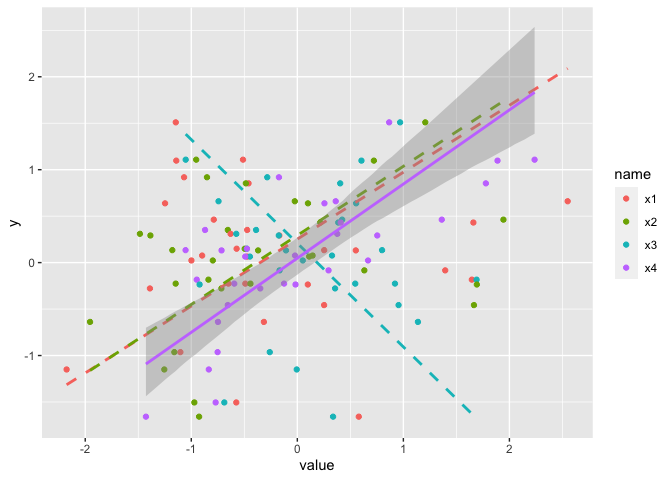

# Smooth lines for Standardised Major Axis (SMA) Regression


## Installation

``` r
devtools::install_github("mattocci27/ggsma")
```

## Function

-   `geom_sma()`: draws fitted lines based on SMA.

## SMA (blue) vs OLS (red)

``` r
library(ggplot2)
library(ggsma)
library(smatr)

data(leaflife)
head(leaflife)
```

    ##   site rain soilp    longev       lma
    ## 1    1 high  high 1.1145511 125.48736
    ## 2    1 high  high 0.5161786  82.28108
    ## 3    1 high  high 0.9718517  71.02316
    ## 4    1 high  high 0.6722023  94.66730
    ## 5    1 high  high 1.0947123 119.70161
    ## 6    1 high  high 2.0606299 205.82589

``` r
leaf_low <- subset(leaflife, soilp == "low")

# lma vs longev only for low soilp sites
ggplot(leaf_low, aes(lma, longev)) +
  geom_point() +
  geom_sma() +
  geom_smooth(method = "lm", col = "red") 
```

    ## `stat_sma()` using method = 'sma' and formula 'y ~ x'

    ## `geom_smooth()` using formula 'y ~ x'

<!-- -->

``` r
# facet for low and high rain sites 
ggplot(leaflife, aes(lma, longev)) +
  geom_point() +
  geom_sma() +
  geom_smooth(method = "lm", col = "red")  +
  facet_wrap( ~ rain)
```

    ## `stat_sma()` using method = 'sma' and formula 'y ~ x'

    ## `geom_smooth()` using formula 'y ~ x'

<!-- -->

## Only shows significant relationships

``` r
# weakly correlated data
library(tidyverse)
set.seed(1234)
S <- clusterGeneration::genPositiveDefMat(5)$Sigma
Cor <- cov2cor(S)
Cor[1, 5] <- Cor[5, 1] <- 0.8
Cor %>% round(2)
```

    ##       [,1] [,2]  [,3]  [,4]  [,5]
    ## [1,]  1.00    0 -0.08 -0.29  0.80
    ## [2,]  0.00    1  0.00  0.00  0.00
    ## [3,] -0.08    0  1.00 -0.10 -0.09
    ## [4,] -0.29    0 -0.10  1.00 -0.28
    ## [5,]  0.80    0 -0.09 -0.28  1.00

``` r
dat <- mvtnorm::rmvnorm(30, mean = rep(0, 5),  sigma = Cor) 
colnames(dat) <- c("y", paste0("x", 1:4))

dat_long <- dat %>%
  as_tibble %>%
  pivot_longer(2:5)

ggplot(dat_long, aes(x = value, y = y, col = name)) +
  geom_point() +
  geom_sma()
```

    ## `stat_sma()` using method = 'sma' and formula 'y ~ x'

<!-- -->

``` r
# shows non-significant relationships using dased lines
ggplot(dat_long, aes(x = value, y = y, col = name)) +
  geom_point() +
  geom_sma(show.sig.only = 1)
```

    ## `stat_sma()` using method = 'sma' and formula 'y ~ x'

<!-- -->

``` r
# only keeps significant relationships 
ggplot(dat_long, aes(x = value, y = y, col = name)) +
  geom_point() +
  geom_sma(show.sig.only = 2)
```

    ## `stat_sma()` using method = 'sma' and formula 'y ~ x'

<!-- -->

Of course, we can do the same thing without using `show.sig.only`
argument.

``` r
dat_long2 <- dat_long %>%
  group_by(name) %>%
  nest() %>%
  mutate(p = map_dbl(data, ~ cor.test(.$y, .$value)$p.value)) %>%
  unnest(cols = c(data))

ggplot(dat_long2, aes(x = value, y = y, col = name)) +
  geom_point() +
  geom_sma(data = dat_long2 %>% filter(p < 0.05)) +
  geom_sma(data = dat_long2 %>% filter(p > 0.05),
           lty = 2, se = FALSE)
```

    ## `stat_sma()` using method = 'sma' and formula 'y ~ x'
    ## `stat_sma()` using method = 'sma' and formula 'y ~ x'

<!-- -->

## Reference

Warton, David I., Ian J. Wright, Daniel S. Falster, and Mark Westoby.
2006. Bivariate Line-Fitting Methods for Allometry. Biological Reviews
81: 259–91. <https://doi.org/10.1017/S1464793106007007>
